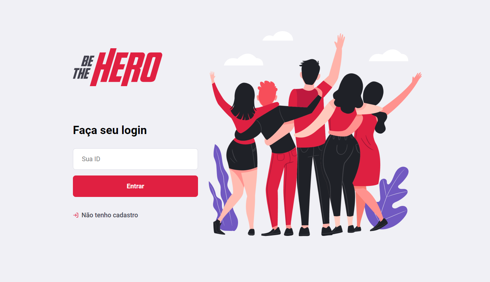

# Projeto Be-the-hero

## Be-the-hero

Esse projeto foi desenvolvido durante a semana omnistack 11, produzida pela Rocketseat. O nome da aplicação desenvolvida é Be The Hero, uma aplicação para cadastro de ONGs e casos cadastrados por elas para que outras pessoas possam ajudar com doações em dinheiro.

  Página de Login:
  
  
  Página de cadastro de ONGs:
  

  Página dos casos cadastrados:
  

  Página para cadastrar um novo caso:
  

